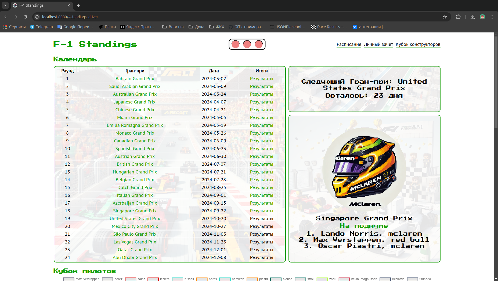
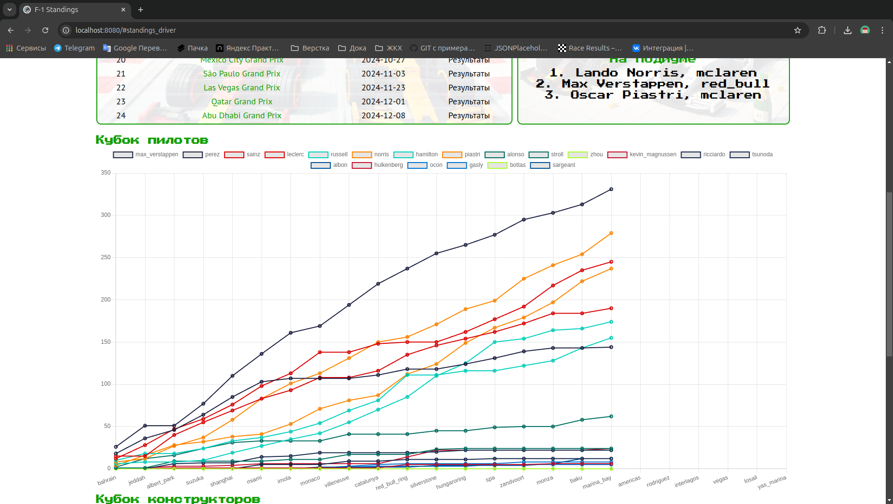

# Проект: Formula-1 Standings

**Автор:** Чугунов Денис (denis.chugunov98@gmail.com)

## Описание функциональности
Страница генерирует текущее состояние гоночного календаря Формулы-1, отображая тройку победителей каждого Гран-при и предоставляя статистику положения пилотов и команд в сезоне в виде графиков.

## Особенности
Проект направлен на отработку взаимодействия с API, обработку получаемых данных, работу с асинхронным кодом и построение архитектуры сайта.

## Пример работы
[Смотреть видео](https://drive.google.com/file/d/16In2_GXoZ9vl_81HWIg0AxnoBB1a3bOm/view?usp=sharing)

